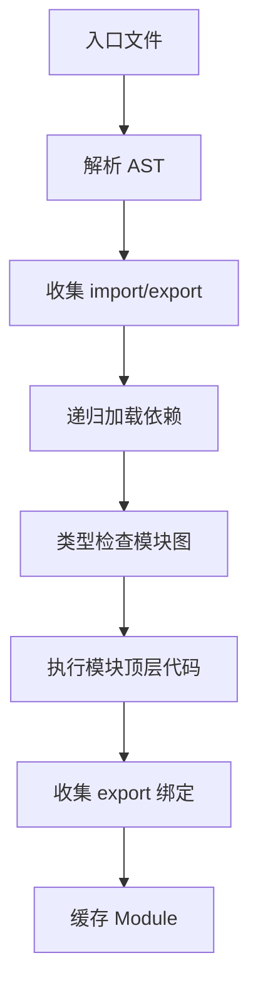

# Icoo 脚本语言设计文档

日期：2026-05-21

## 1. 目标

Icoo 是一个使用 Rust 实现的小型脚本语言。当前语法使用大括号表达代码块，对象模型更严格：类属性必须显式声明，继承使用 `class Child <- Parent { ... }` 语法。

第一版推荐实现为 AST 解释器。这样在语言语法和运行时语义还未完全稳定时，修改成本更低，也更容易调试。等核心行为稳定后，再考虑增加字节码虚拟机。

主要目标：

- 简单的大括号块语法。
- 使用 `{ ... }` 表示代码块。
- 支持变量和常量。
- 支持 `final` 一次赋值绑定。
- 支持函数和方法。
- 支持语言级命名规范：常量大写、类名首字母大写、方法名使用下划线风格。
- 支持类，并且类属性必须显式声明。
- 支持单继承，继承语法使用 `<-`。
- 支持可选类型标注。
- 所有数据类型都自带基础方法，例如 `to_string()`。
- 支持协程和事件循环设计，用于可暂停、可恢复的执行流程，并避免运行时被单线程调度瓶颈限制。
- 运行时报错信息带源码位置。

第一版不做：

- 多继承。
- 完整异步 I/O 运行时。
- 装饰器。
- 完整静态类型系统。
- 包管理器和第三方依赖解析。
- 跨包复杂模块系统。

## 2. 语言示例

```python
const PI: Float = 3.14159

let version: String = "0.1.0"
let count = 10
final runtime_id: String
runtime_id = "icoo-" + count.to_string()

fn add(a: Int, b: Int) -> Int {
    return a + b

}
class Animal {
    let name: String

    fn init(self, name: String) {
        self.name = name

    }
    fn speak(self) {
        print("...")

    }
}
class Dog <- Animal {
    let breed: String
    final owner_id: String

    fn init(self, name: String, breed: String, owner_id: String) {
        super.init(name)
        self.breed = breed
        self.owner_id = owner_id

    }
    fn speak(self) {
        print(self.name + " says woof")

    }
}
let dog = Dog("Lucky", "Border Collie", "U001")
dog.speak()

print(count.to_string())
print(dog.to_string())
```

## 3. 类型设计

Icoo 采用“动态执行 + 可选类型标注”的设计。第一版即使不做完整静态类型检查，也应该在语法分析阶段保留类型标注，方便后续扩展。

内置类型：

```text
Nil
Bool
Int
Float
Number  # 仅用于类型检查，表示 Int 或 Float
String
Array
Map
Function
Coroutine
Task
EventLoop
Class
Instance
Any
```

类型标注支持泛型形式：

```python
let values: Array<Int> = [1, 2, 3]
let scores: Map<String, Int> = {"Tom": 95}
let task: Task<String> = loop.spawn(load_name())
```

第一版泛型主要用于静态检查。运行时仍保留动态值模型，集合元素类型由类型检查器基于字面量和函数签名做保守推断。

字符串：

```python
let single_line = "hello"
let multi_line = """
hello
world
"""
let name = "Icoo"
let message = f"hello {name}"
let report = f"""
name={name}
version={version}
"""
```

规则：

- 普通字符串使用双引号 `"..."`。
- 多行字符串使用三引号 `"""..."""`，内容可以跨行。
- 字符串模板使用 `f"..."` 或 `f"""..."""`。
- 模板中 `{表达式}` 会执行表达式并转换为字符串。
- 模板中 `{{` 表示字面量 `{`，`}}` 表示字面量 `}`。

变量声明：

```python
let age: Int = 18
let name = "Tom"
```

常量声明：

```python
const MAX_COUNT: Int = 100
```

一次赋值绑定：

```python
final config_path: String
config_path = "./config.icoo"
config_path = "./other.icoo"  # 错误：final 只能第一次赋值
```

规则：

- `let` 声明可变绑定。
- `const` 声明不可变绑定，并且必须在声明时初始化。
- `const` 必须初始化。
- 对 `const` 重新赋值是运行时错误。
- `final` 声明一次赋值绑定。
- `final` 可以声明时初始化，也可以延迟到后续第一次赋值。
- `final` 如果没有声明时初始化，则必须写类型标注。
- 读取尚未初始化的 `final` 是运行时错误。
- 对已经初始化的 `final` 再次赋值是运行时错误。
- 局部变量的类型标注可选。
- 类属性建议第一版强制写类型标注，降低实现复杂度，也让对象结构更清晰。

## 4. 命名规范

Icoo 在语言层面对部分命名做强约束。违反命名规范应在 Parser 或 Resolver 阶段报错，推荐放在 Resolver 阶段统一检查，这样错误信息可以结合声明类型给出更清晰的提示。

常量命名：

```python
const MAX_COUNT: Int = 100
const PI: Float = 3.14159
const _DEBUG_: Bool = true
```

规则：

- `const` 声明的名称只能使用大写字母、数字和下划线。
- `const` 声明的名称不能包含小写字母。
- `const` 声明的名称必须至少包含一个大写字母。
- `const` 声明的名称不能以数字开头。
- 第一版“特殊符号”只允许 `_`，不允许把 `+`、`-`、`*`、`$` 等运算符或符号作为标识符的一部分，避免和词法规则冲突。

非法示例：

```python
const max_count = 100     # 错误：包含小写字母
const version = "0.1.0"   # 错误：包含小写字母
const _ = 1               # 错误：没有大写字母
const 1_COUNT = 1         # 错误：不能以数字开头
```

类名命名：

```python
class User {
    let name: String

}
class HttpClient {
    let base_url: String
}
```

规则：

- 类名首字母必须大写。
- 推荐使用 PascalCase，例如 `UserProfile`、`HttpClient`。
- 第一版只强制首字母大写，不强制后续字符必须完全符合 PascalCase。

方法命名：

```python
class User {
    let name: String

    fn get_name(self) -> String {
        return self.name
    }
}
```

规则：

- 方法名必须使用下划线风格，也就是 snake_case。
- 方法名只能使用小写字母、数字和下划线。
- 方法名不能以数字开头。
- 方法名不能包含大写字母。
- 单个小写单词也视为合法 snake_case，例如 `speak`、`init`。
- 内置方法也遵守该规则，例如 `to_string()`、`type_name()`、`is_empty()`。

非法示例：

```python
class User {
    fn getName(self):      # 错误：驼峰命名
        return self.name

    fn GetName(self):      # 错误：首字母大写
        return self.name
}
```

普通变量和类属性第一版不强制命名风格，但推荐使用 snake_case。

`final` 不按 `const` 常量规则强制大写。它表达“一次赋值”，不一定表达“全局常量”。例如类属性 `final owner_id: String` 是合法的。

## 5. 内置类型方法

Icoo 中所有数据类型都应支持内置方法调用。也就是说，基础类型不是只能通过全局函数操作，也可以像对象一样调用方法。

示例：

```python
let age = 18
let name = "Tom"
let values = [1, 2, 3]
let scores = {"Tom": 95, "Lucy": 88}

print(age.to_string())
print(name.len())
print(values.len())
print(scores.has("Tom"))
print(nil.to_string())
```

所有类型都必须支持的基础方法：

```text
to_string() -> String
type_name() -> String
```

各类型推荐方法：

```text
Nil
  to_string() -> String      # "nil"
  type_name() -> String      # "Nil"

Bool
  to_string() -> String      # "true" 或 "false"
  type_name() -> String
  to_int() -> Int            # true 为 1，false 为 0

Int
  to_string() -> String
  type_name() -> String
  to_float() -> Float
  abs() -> Int

Float
  to_string() -> String
  type_name() -> String
  to_int() -> Int
  abs() -> Float

String
  to_string() -> String
  type_name() -> String
  len() -> Int
  is_empty() -> Bool
  contains(value: String) -> Bool

Array
  to_string() -> String
  type_name() -> String
  len() -> Int
  is_empty() -> Bool

  # 参考 JavaScript Array 的基础变更方法
  push(value: Any) -> Nil
  pop() -> Any
  shift() -> Any
  unshift(value: Any) -> Int

  # 参考 JavaScript Array 的查询和派生方法
  at(index: Int) -> Any
  includes(value: Any) -> Bool
  index_of(value: Any) -> Int
  slice(start: Int, end: Int?) -> Array
  splice(start: Int, deleteCount: Int, items: Any...) -> Array
  join(separator: String = ",") -> String
  reverse() -> Array

  # 依赖函数值，建议在函数系统稳定后实现
  for_each(callback: Function) -> Nil
  map(callback: Function) -> Array
  filter(callback: Function) -> Array
  reduce(callback: Function, initial: Any?) -> Any
  find(callback: Function) -> Any
  find_index(callback: Function) -> Int
  some(callback: Function) -> Bool
  every(callback: Function) -> Bool

Map
  to_string() -> String
  type_name() -> String
  len() -> Int
  is_empty() -> Bool

  # 参考 JavaScript Map
  size() -> Int
  has(key: String) -> Bool
  get(key: String) -> Any
  set(key: String, value: Any) -> Map
  delete(key: String) -> Bool
  clear() -> Nil
  keys() -> Array
  values() -> Array
  entries() -> Array
  for_each(callback: Function) -> Nil

Function
  to_string() -> String
  type_name() -> String

Coroutine
  to_string() -> String
  type_name() -> String

Task
  to_string() -> String
  type_name() -> String
  is_done() -> Bool
  is_failed() -> Bool
  result() -> Any
  cancel() -> Nil

EventLoop
  to_string() -> String
  type_name() -> String
  spawn(coroutine: Coroutine) -> Task
  run() -> Nil
  run_until(task: Task) -> Any
  stop() -> Nil

Class
  to_string() -> String
  type_name() -> String

Instance
  to_string() -> String
  type_name() -> String
```

用户类实例默认继承 `to_string()` 和 `type_name()` 行为：

```python
class User {
    let name: String

    fn init(self, name: String) {
        self.name = name

    }
}
let user = User("Tom")
print(user.to_string())   # 默认类似 "<User instance>"
print(user.type_name())   # "User"
```

用户可以在类中定义同名方法覆盖默认行为：

```python
class User {
    let name: String

    fn init(self, name: String) {
        self.name = name

    }
    fn to_string(self) -> String {
        return "User(" + self.name + ")"
    }
}
```

内置方法规则：

- 方法调用语法统一使用 `value.method(args...)`。
- `Array` 和 `Map` 的集合方法参考 JavaScript 语义，但命名遵守 Icoo 的 snake_case 规则，例如 `index_of`、`for_each`、`find_index`。
- `len()` 是 Icoo 为所有可计数类型提供的统一方法；对 `Map` 来说，`len()` 与 `size()` 等价。
- 如果值是用户类实例，优先查找实例类中定义的方法。
- 如果用户类没有定义该方法，再查找所有实例共有的默认内置方法。
- 如果值是基础类型，则查找该类型对应的内置方法表。
- 找不到方法时，报运行时错误。
- `to_string()` 是语言级通用转换方法，标准库函数 `str(value)` 应直接调用该方法。

## 6. 词法结构

Icoo 使用大括号定义代码块。

主要 Token：

```text
IDENT
NUMBER
STRING
NEWLINE
INDENT
DEDENT
EOF

+ - * / %
= == !=
< <= > >=
<-          继承箭头
. , : ( ) [ ] { }
```

关键字：

```text
let
const
final
fn
class
if
elif
else
while
for
in
return
break
continue
true
false
nil
self
super
and
or
not
import
from
as
async
co
yield
await
```

词法器处理 `<` 时，应优先匹配最长 token：

```text
<-  LeftArrow
<=  LessEqual
<   Less
```

## 7. 语法设计

顶层程序：

```ebnf
program        = statement* EOF ;

statement      = let_decl
               | const_decl
               | final_decl
               | fn_decl
               | coroutine_fn_decl
               | class_decl
               | if_stmt
               | while_stmt
               | return_stmt
               | yield_stmt
               | await_stmt
               | break_stmt
               | continue_stmt
               | expr_stmt ;

let_decl       = "let" IDENT type_hint? ("=" expression)? ;
const_decl     = "const" IDENT type_hint? "=" expression ;
final_decl     = "final" IDENT (type_hint ("=" expression)? | "=" expression) ;

type_hint      = ":" type_name ;
type_name      = IDENT ;

fn_decl        = "fn" IDENT "(" params? ")" return_type? ":" block ;
coroutine_fn_decl = "async" "fn" IDENT "(" params? ")" return_type? ":" block ;
params         = param ("," param)* ;
param          = IDENT type_hint? ;
return_type    = "->" type_name ;

class_decl     = "class" IDENT inheritance? ":" class_block ;
inheritance    = "<-" IDENT ;

class_block    = NEWLINE INDENT class_member* DEDENT ;
class_member   = field_decl | fn_decl | coroutine_fn_decl ;
field_decl     = let_field | const_field | final_field ;
let_field      = "let" IDENT type_hint ("=" expression)? ;
const_field    = "const" IDENT type_hint "=" expression ;
final_field    = "final" IDENT type_hint ("=" expression)? ;

block          = NEWLINE INDENT statement* DEDENT ;
yield_stmt     = "yield" expression? ;        // 兼容/底层能力，推荐用 await sleep(0)
await_stmt     = "await" expression ;
```

表达式：

```ebnf
expression     = assignment ;
assignment     = call_or_get "=" assignment | logic_or ;
logic_or       = logic_and ("or" logic_and)* ;
logic_and      = equality ("and" equality)* ;
equality       = comparison (("==" | "!=") comparison)* ;
comparison     = term ((">" | ">=" | "<" | "<=") term)* ;
term           = factor (("+" | "-") factor)* ;
factor         = unary (("*" | "/" | "%") unary)* ;
unary          = ("not" | "-" | "await") unary | call_or_get ;
call_or_get    = primary (call | get)* ;
call           = "(" args? ")" ;
get            = "." IDENT ;
primary        = NUMBER
               | STRING
               | "true"
               | "false"
               | "nil"
               | IDENT
               | "self"
               | "super"
               | array_literal
               | map_literal
               | "(" expression ")" ;

array_literal  = "[" elements? "]" ;
elements       = expression ("," expression)* ","? ;

map_literal    = "{" map_entries? "}" ;
map_entries    = map_entry ("," map_entry)* ","? ;
map_entry      = STRING ":" expression ;
```

第一版 `Map` 字面量只支持字符串 key：

```python
let scores = {"Tom": 95, "Lucy": 88}
```

这是为了降低运行时实现复杂度。后续如果需要更贴近 JavaScript `Map`，可以把 key 扩展为任意可比较值。

## 8. 协程设计

Icoo 的协程直接以事件循环为核心设计。协程本身表示可暂停、可恢复的执行体，但用户代码不直接手动驱动协程；协程由 `EventLoop` 调度，用户通过 `Task` 句柄观察结果、等待完成或取消任务。

为避免语言运行时被单线程限制，`EventLoop` 是语言层抽象，不等同于一个固定 OS 线程。第一版应按“可多线程调度”的模型设计：

- 语言层采用 `async fn` + `await` 语义：每个异步任务通过 `await`、定时器或 I/O 等待点主动让出控制权。
- 运行时层可以把不同 `Task` 分发到多个 worker 线程执行，默认后端建议使用 Tokio multi-thread runtime。
- Icoo 源码不暴露 Tokio 类型；用户只接触 `async fn`、`await`、`EventLoop`、`Task` 和 `Coroutine`。
- `EventLoop` 负责维护任务表、就绪任务、等待源、定时器、取消状态和错误传播；这些结构可以由底层后端并发驱动。
- 不做抢占式时间片。CPU 密集型异步函数如果长期不 `await`，仍然会占住当前 worker，因此需要 `await sleep(0)` 或显式放入阻塞/计算任务池。
- 跨线程调度只允许发生在运行时认为安全的任务边界。捕获了不可跨线程状态的协程可以被限制在同一个本地任务集合中运行。

推荐实现分层：

```text
Icoo 源语言
  async fn / await / EventLoop / Task / Coroutine
        |
        v
RuntimeBackend trait
        |
        +-- TokioBackend（默认，多 worker 线程）
        +-- LocalBackend（测试或最小实现，可单线程）
```

因此，Tokio 可以作为默认实现依赖，但不应成为 Icoo 的语言特性。这样后续可以替换运行时后端，或在嵌入场景中使用自定义调度器。

推荐语法：

```python
async fn worker(name: String) {
    print(f"{name}: start")
    await sleep(0)
    print(f"{name}: end")
    return name

}
let loop = EventLoop()
let a = loop.spawn(worker("A"))
let b = loop.spawn(worker("B"))

loop.run()

print(a.result())      # "A"
print(b.result())      # "B"
```

等待任务：

```python
async fn counter(limit: Int) -> Int {
    let i = 0
    while i < limit {
        await sleep(0)
        i = i + 1
    }
    return i

}
async fn main() {
    let loop = current_loop()
    let task = loop.spawn(counter(3))
    let value = await task
    print(value.to_string())

}
let loop = EventLoop()
loop.spawn(main())
loop.run()
```

核心规则：

- `async fn` 定义异步函数；实现层会把它编译为可恢复的 `Coroutine`。
- 调用协程函数不会立即执行函数体，而是返回 `Coroutine` 对象。
- `EventLoop.spawn(coroutine)` 把协程加入事件循环，返回 `Task`。
- `EventLoop.run()` 运行事件循环，直到没有可运行任务或被 `stop()` 停止。
- `EventLoop.run_until(task)` 运行事件循环，直到指定任务完成，并返回任务结果。
- `current_loop()` 只能在事件循环正在运行的协程内调用，返回当前任务所属事件循环。
- `await task` 暂停当前协程，直到目标 `Task` 完成；完成后表达式值为任务结果。
- `await sleep(0)` 是推荐的主动让出调度写法。
- `return expression` 结束协程，并把最终结果写入对应 `Task`。
- `yield` 作为兼容/底层语句保留，用户代码推荐不用；如果使用，只能出现在 `async fn` 内部。
- `await` 只能出现在 `async fn` 内部；顶层 `await` 第一版不支持。
- 协程可以作为普通值保存、传参、放入 `Array` 或 `Map`。
- 协程函数可以作为类方法。
- 同一个 `Coroutine` 只能被一个事件循环 `spawn` 一次；重复调度是运行时错误。

类方法示例：

```python
class Job {
    let name: String

    fn init(self, name: String) {
        self.name = name

    }
    async fn run(self) {
        await sleep(0)
        print(self.name + ":start")
        await sleep(0)
        print(self.name + ":end")
        return "done"

    }
}
let loop = EventLoop()
let task = loop.spawn(Job("build").run())
loop.run_until(task)
```

事件循环中的任务关系：

```python
async fn fetch_user(id: Int) -> String {
    await sleep(0)
    return f"user:{id}"

}
async fn handle_request() {
    let loop = current_loop()
    let user_task = loop.spawn(fetch_user(7))
    let user = await user_task
    print(user)

}
let loop = EventLoop()
loop.spawn(handle_request())
loop.run()
```

协程状态：

```text
Created     已创建，尚未开始执行
Queued      已加入事件循环，等待运行
Running     正在执行，防止重入调度
Suspended   已执行到 await/yield，等待重新入队
Waiting     正在 await 某个任务、定时器或 I/O
Done        已 return 或运行结束
Failed      执行中发生错误
Cancelled   已取消
```

错误传播：

- 协程内部运行时错误会让协程进入 `Failed` 状态。
- 对应 `Task` 进入失败状态，并保存错误。
- `await failed_task` 会重新抛出该错误。
- `task.result()` 如果任务失败，也会抛出该错误。
- 如果事件循环结束时存在失败任务但无人 `await` 或读取 `result()`，第一版应打印未处理任务错误，避免静默失败。

调度模型：

- 事件循环维护逻辑上的就绪队列；多线程后端可以把就绪任务拆分到多个 worker 队列。
- `spawn()` 将新任务提交给运行时后端，返回语言层 `Task` 句柄。
- `await task` 将当前任务移入等待队列，并在目标任务完成后重新入队。
- `await sleep(0)` 将当前任务重新提交为可运行任务，后续可能由同一个 worker 或其他 worker 继续执行。
- `run()` 启动或进入后端运行时，直到就绪任务和等待源都为空，或被 `stop()` 停止。
- `sleep(ms)` 创建一个定时器任务，完成值为 `nil`，可以用 `await sleep(100)` 等待。
- 第一版没有真实异步 I/O 时，等待源主要是 `Task` 依赖和 `sleep(ms)` 定时器。

```python
async fn ticker(name: String) {
    print(name + ":1")
    await sleep(0)
    print(name + ":2")

}
let loop = EventLoop()
loop.spawn(ticker("A"))
loop.spawn(ticker("B"))
loop.run()

# 输出顺序：
# A:1
# B:1
# A:2
# B:2
```

实现建议：

- AST 解释器阶段不要把 Rust 调用栈直接当作协程栈。
- 协程函数体应编译成可恢复状态机，或先在 AST 层维护 `CoroutineFrame`。
- 事件循环应拥有任务表和后端句柄，`Task` 只是任务 ID 的安全句柄，不直接暴露 Tokio `JoinHandle`。
- 为降低第一版复杂度，推荐把 `yield` 视为兼容语句；主要用户 API 是表达式级 `await`。
- 第一版 `await` 只等待 `Task`；后续再扩展到定时器、I/O Future、Channel。
- 如果使用 Tokio，`await sleep(ms)` 可映射到 `tokio::time::sleep()`；主动让步可用 `await sleep(0)` 或后续内置 `yield_now()`。
- CPU 密集型或阻塞型内置函数应通过专门 API 进入 blocking pool，避免阻塞 async worker。
- 后续如果引入字节码 VM，协程恢复点可以直接保存 instruction pointer，比 AST 状态机更干净。

## 9. 类属性声明

类实例属性必须在类体中显式声明。

```python
class User {
    let name: String
    let age: Int = 0
    const ROLE: String = "user"
    final user_id: String

    fn init(self, name: String, user_id: String) {
        self.name = name
        self.user_id = user_id
    }
}
```

属性规则：

- `let` 属性是可变实例属性。
- `const` 属性是实例常量属性，必须在声明时初始化，之后不能再赋值；命名也遵守 `const` 常量命名规则。
- `final` 属性是实例一次赋值属性，可以没有默认值，但只能被第一次赋值。
- 属性可以有默认值。
- 没有默认值的属性，必须在构造完成前赋值。这个规则主要适用于 `let` 和 `final` 属性。
- 给未声明属性赋值是错误。
- 子类继承父类所有属性。
- 第一版不允许子类声明与父类同名的属性。

非法示例：

```python
class User {
    let name: String

    fn init(self, name: String) {
        self.name = name
        self.email = "x@test.com"  # 错误：email 未声明
    }
}
```

实例构造流程：

1. 收集父类链上的字段。
2. 收集当前类声明的字段。
3. 创建包含所有声明字段的实例。
4. 执行字段默认值初始化。
5. 如果存在 `init` 方法，则调用 `init`。
6. 检查所有必填字段是否都已初始化。

## 10. 继承

Icoo 支持单继承。

```python
class Dog <- Animal {
    let breed: String
}
```

规则：

- 一个类最多只能有一个父类。
- 子类继承父类方法。
- 子类继承父类属性。
- 子类方法可以覆盖父类方法。
- 第一版子类属性不能重定义父类属性。
- `super.method(...)` 用于调用父类方法。

方法查找顺序：

1. 实例字段。
2. 当前类方法。
3. 父类方法。
4. 找不到则报运行时错误。

## 11. 运行时模型

推荐的 Rust 值表示：

```rust
pub enum Value {
    Nil,
    Bool(bool),
    Int(i64),
    Float(f64),
    String(String),
    Array(Vec<Value>),
    Map(std::collections::HashMap<String, Value>),
    Function(std::rc::Rc<Function>),
    Coroutine(std::rc::Rc<std::cell::RefCell<Coroutine>>),
    Task(TaskId),
    EventLoop(std::rc::Rc<std::cell::RefCell<EventLoop>>),
    Class(std::rc::Rc<Class>),
    Instance(std::rc::Rc<std::cell::RefCell<Instance>>),
}
```

上面的 `Rc<RefCell<...>>` 适合最小 AST 解释器或 `LocalBackend`。如果启用 Tokio 多线程后端，运行时不能直接把这些值跨 worker 移动。需要在设计上二选一：

- 共享并发模型：把可跨任务共享的运行时对象改为 `Arc<Mutex<T>>` 或 `Arc<RwLock<T>>`，并明确锁粒度，避免解释器执行期间长时间持锁。
- 任务隔离模型：每个协程拥有自己的 `CoroutineFrame` 和局部环境；跨任务通信只通过 `Task` 结果、Channel 或显式可发送值完成。用户实例默认不跨线程共享。

推荐第一版采用“任务隔离优先，少量共享对象显式封装”的策略。这样可以使用 Tokio multi-thread runtime 避免单线程瓶颈，同时不把整个对象系统过早改成高锁竞争结构。

多线程后端下建议增加运行时安全标记：

```rust
pub enum ShareMode {
    LocalOnly,   // 只能在创建它的本地任务集合中使用
    Sendable,    // 可以移动到其他 worker
    Shared,      // 内部带同步保护，可以多任务共享
}
```

默认规则：

- `Nil`、`Bool`、`Int`、`Float`、不可变 `String` 可以跨线程移动。
- `Array`、`Map` 只有在元素和值全部可发送时才可作为任务结果跨线程传递。
- `Function`、`Class` 可以作为不可变元数据共享，但闭包捕获的环境必须满足可发送规则。
- `Instance` 默认 `LocalOnly`；后续可以增加显式并发安全类或 actor 风格对象。
- `CoroutineFrame` 不共享，只能由当前正在执行该任务的 worker 拥有。

协程运行时结构：

```rust
pub struct Coroutine {
    pub name: String,
    pub state: CoroutineState,
    pub frame: CoroutineFrame,
    pub owner_task: Option<TaskId>,
}

pub enum CoroutineState {
    Created,
    Queued,
    Running,
    Suspended,
    Waiting,
    Done,
    Failed,
    Cancelled,
}

pub struct CoroutineFrame {
    pub env: EnvRef,
    pub body: Vec<Stmt>,
    pub instruction: usize,
    pub stack: Vec<Value>,
    pub waiting_on: Option<WaitSource>,
}
```

事件循环结构：

```rust
pub type TaskId = u64;

pub struct EventLoop {
    pub next_task_id: TaskId,
    pub tasks: std::collections::HashMap<TaskId, Task>,
    pub ready: std::collections::VecDeque<TaskId>,
    pub waiting: std::collections::HashMap<TaskId, WaitSource>,
    pub stopped: bool,
}

pub struct Task {
    pub id: TaskId,
    pub coroutine: std::rc::Rc<std::cell::RefCell<Coroutine>>,
    pub state: TaskState,
    pub result: Option<Value>,
    pub error: Option<RuntimeError>,
    pub awaiters: Vec<TaskId>,
}

pub enum TaskState {
    Queued,
    Running,
    Waiting,
    Done,
    Failed,
    Cancelled,
}

pub enum WaitSource {
    Task(TaskId),
    Timer(TimerId),
    Io(IoToken),
}
```

运行时后端抽象：

```rust
pub trait RuntimeBackend {
    fn spawn(&self, task: RunnableTask) -> BackendTaskHandle;
    fn yield_now(&self) -> BackendYield;
    fn sleep(&self, millis: u64) -> BackendSleep;
    fn block_on(&self, task: TaskId) -> Result<Value, RuntimeError>;
    fn shutdown(&self);
}

pub struct TokioBackend {
    pub runtime: tokio::runtime::Runtime,
    pub worker_threads: usize,
}
```

`EventLoop` 持有 `RuntimeBackend`，而不是直接持有 Tokio 运行时类型。`Task` 保存语言层状态和结果；后端句柄只负责唤醒、取消和运行 Rust future。这样 `EventLoop` 的公开行为稳定，底层可以从本地后端切换到 Tokio 多线程后端。

如果继续使用 AST 解释器，`CoroutineFrame` 至少需要保存：

- 当前执行到的语句位置。
- 当前局部变量环境。
- 当前块嵌套栈。
- `while` 等控制流的恢复位置。
- 当前等待源，例如任务、定时器或 I/O。

这会让 AST 解释器复杂度明显上升。因此协程是推动后续字节码 VM 的重要理由之一。

类元数据：

```rust
pub struct Class {
    pub name: String,
    pub superclass: Option<std::rc::Rc<Class>>,
    pub fields: Vec<FieldDef>,
    pub methods: std::collections::HashMap<String, Function>,
}

pub struct FieldDef {
    pub name: String,
    pub kind: FieldKind,
    pub type_hint: TypeRef,
    pub initializer: Option<Expr>,
}

pub enum FieldKind {
    Mutable,       // let
    Const,         // const，声明时初始化后不可修改
    Final,         // final，第一次赋值后不可修改
}
```

实例状态：

```rust
pub struct Instance {
    pub class: std::rc::Rc<Class>,
    pub fields: std::collections::HashMap<String, FieldValue>,
}

pub struct FieldValue {
    pub value: Value,
    pub initialized: bool,
    pub kind: FieldKind,
}
```

局部变量和全局变量也应使用类似的绑定策略：

```rust
pub enum BindingKind {
    Mutable,       // let
    Const,         // const，声明时必须初始化
    Final,         // final，可延迟初始化，但只能赋值一次
}

pub struct Binding {
    pub value: Value,
    pub initialized: bool,
    pub kind: BindingKind,
}
```

函数应捕获定义时的环境，以支持闭包。

方法本质上是函数。从实例访问方法时，解释器需要自动绑定 `self`。

基础类型方法可以通过“内置类型方法表”实现，而不需要把 `Int`、`String` 等全部包装成用户类实例。

推荐设计：

```rust
pub type NativeMethod = fn(receiver: Value, args: Vec<Value>) -> RuntimeResult<Value>;

pub struct BuiltinMethods {
    pub nil_methods: MethodTable,
    pub bool_methods: MethodTable,
    pub int_methods: MethodTable,
    pub float_methods: MethodTable,
    pub string_methods: MethodTable,
    pub array_methods: MethodTable,
    pub map_methods: MethodTable,
    pub function_methods: MethodTable,
    pub class_methods: MethodTable,
    pub instance_default_methods: MethodTable,
}

pub type MethodTable = std::collections::HashMap<String, NativeMethod>;
```

属性访问 `value.name` 的处理顺序：

1. 如果 `value` 是用户类实例，先查找实例字段。
2. 如果 `value` 是用户类实例，再查找类方法和父类方法。
3. 如果 `value` 是用户类实例且仍未找到，查找实例默认内置方法。
4. 如果 `value` 是基础类型，查找该类型的内置方法表。
5. 找不到则报运行时错误。

## 12. AST 结构

核心语句节点：

```rust
pub enum Stmt {
    Let(LetDecl),
    Const(ConstDecl),
    Final(FinalDecl),
    Function(FunctionDecl),
    CoroutineFunction(FunctionDecl),
    Class(ClassDecl),
    If(IfStmt),
    While(WhileStmt),
    Return(Option<Expr>),
    Yield(Option<Expr>),
    Break,
    Continue,
    Expr(Expr),
}

pub struct ClassDecl {
    pub name: Identifier,
    pub superclass: Option<Identifier>,
    pub fields: Vec<FieldDecl>,
    pub methods: Vec<FunctionDecl>,
}

pub struct FieldDecl {
    pub kind: FieldKind,
    pub name: Identifier,
    pub type_hint: TypeRef,
    pub initializer: Option<Expr>,
}

pub struct FunctionDecl {
    pub name: Identifier,
    pub params: Vec<Param>,
    pub return_type: Option<TypeRef>,
    pub body: Vec<Stmt>,
    pub is_coroutine: bool,
}
```

## 13. 解释器架构

推荐项目结构：

```text
src/
  main.rs
  lib.rs

  lexer/
    mod.rs
    token.rs

  parser/
    mod.rs
    ast.rs

  resolver/
    mod.rs

  typecheck/
    mod.rs
    types.rs

  runtime/
    mod.rs
    value.rs
    env.rs
    function.rs
    class.rs
    coroutine.rs
    builtin_methods.rs
    native.rs

  interpreter/
    mod.rs

  error/
    mod.rs
```

执行流程：

```text
source code
  -> lexer
  -> tokens
  -> parser
  -> AST
  -> resolver
  -> optional type checker
  -> interpreter
  -> runtime values
```

Resolver 负责：

- 解析局部变量引用。
- 处理闭包捕获。
- 检测非法 `self`。
- 检测非法 `super`。
- 校验类继承引用。
- 校验类属性声明冲突。
- 校验命名规范，例如常量名、类名、方法名。
- 校验 `const` 是否声明时初始化。
- 校验 `final` 是否存在非法重复赋值。第一版可以在运行时做完整检查，Resolver 只做明显的声明错误检查。
- 校验 `await` 只能出现在 `async fn` 内部。
- 校验 `yield` 如果启用，只能出现在 `async fn` 内部。
- 校验协程函数和普通函数的返回、暂停语义边界。

## 14. 错误处理

错误分类：

```text
LexerError
ParseError
ResolveError
TypeError
RuntimeError
CoroutineError
```

每个错误应包含：

```text
file
line
column
message
```

示例：

```text
example.icoo:12:9: cannot assign undeclared field 'email' on class 'User'
example.icoo:3:7: constant name 'max_count' must use uppercase letters, digits, or '_'
example.icoo:8:7: class name 'user' must start with an uppercase letter
example.icoo:15:8: method name 'getName' must use snake_case
example.icoo:21:1: final binding 'runtime_id' can only be assigned once
example.icoo:28:14: final field 'owner_id' can only be assigned once
example.icoo:34:5: yield can only be used inside async functions
example.icoo:40:1: coroutine 'counter' has already been spawned
example.icoo:45:9: await can only be used inside async functions
example.icoo:52:1: task 3 failed: division by zero
```

Token 源码位置：

```rust
pub struct Span {
    pub line: usize,
    pub column: usize,
    pub start: usize,
    pub end: usize,
}
```

## 15. 标准库 MVP

第一版内置函数：

```text
print(value)
len(value)
str(value)
int(value)
float(value)
type(value)
is_coroutine(value)
is_task(value)
current_loop()
sleep(ms: Int) -> Task
```

第一版内置模块直接注册为全局常量，不依赖 `import`：

```text
math
time
json
env
```

`math` 模块：

```text
math.abs(value: Number) -> Number
math.floor(value: Number) -> Int
math.ceil(value: Number) -> Int
math.round(value: Number) -> Int
math.min(left: Number, right: Number) -> Number
math.max(left: Number, right: Number) -> Number
math.random() -> Float
```

`time` 模块：

```text
time.now_ms() -> Int
time.now_sec() -> Int
```

`json` 模块：

```text
json.stringify(value: Any) -> String
json.parse(text: String) -> Any
```

`json.stringify` 支持 `Nil`、`Bool`、`Int`、`Float`、`String`、`Array`、`Map`。函数、类、实例、协程、任务和事件循环等运行时对象不参与 JSON 序列化。

`env` 模块：

```text
env.cwd() -> String
env.args() -> Array<String>
env.get(name: String) -> String | Nil
env.has(name: String) -> Bool
```

第一版 `env` 模块只提供读取能力，不提供 `set`。这是为了避免脚本在运行时修改进程级环境变量带来的隐式副作用。

后续新增内置库统一使用 `std.` 前缀作为标准库命名空间。已有的 `math`、`time`、`json`、`env` 仍保留全局访问能力，也可以通过 `std.*` 导入后使用；新增内置库默认必须显式导入，不会注册为全局常量：

内置模块在 Rust 代码中按模块拆成独立单元，统一登记在 `src/native_modules/`。每个单元声明自己的导入路径、内部模块 kind、类型名和可导出方法，解释器和类型检查器都从同一份注册表读取，避免新增标准库时同时修改多处分发白名单。

```python
import "std.io" as io
import "std.io.fs" as fs
import "std.os" as os
import "std.yaml" as yaml
import "std.toml" as toml
import "std.net.http.client" as http_client
import "std.net.http.server" as http_server
import "std.web.ino" as ino
```

`std.io` 模块：

```text
io.print(value: Any) -> Nil
```

`io.print` 使用当前解释器输出通道，语义与全局 `print` 一致。标准输入、二进制流和异步 I/O 后续再设计。

`std.io.fs` 模块：

```text
fs.exists(path: String) -> Bool
fs.is_file(path: String) -> Bool
fs.is_dir(path: String) -> Bool
fs.read_text(path: String) -> String
fs.write_text(path: String, content: String) -> Nil
fs.append_text(path: String, content: String) -> Nil
fs.list_dir(path: String) -> Array<String>
```

`fs.write_text` 会创建或覆盖目标文件，`fs.append_text` 会在文件末尾追加文本并在文件不存在时创建。第一版不做沙箱隔离，调用方应只对可信路径执行文件操作；后续可以增加运行时权限策略或工作目录限制。

`std.os` 模块：

```text
os.name() -> String
os.family() -> String
os.arch() -> String
os.pid() -> Int
os.cwd() -> String
os.args() -> Array<String>
os.exe_path() -> String | Nil
os.get_env(name: String) -> String | Nil
os.has_env(name: String) -> Bool
```

`std.os` 第一版只提供读取进程和平台信息的能力，不提供 `set_env`、`exit`、进程启动等带强副作用的能力。后续可以在权限模型明确后再扩展。

`std.yaml` 模块：

```text
yaml.stringify(value: Any) -> String
yaml.parse(text: String) -> Any
```

`yaml.stringify` 支持 `Nil`、`Bool`、`Int`、`Float`、`String`、`Array`、`Map`。函数、类、实例、协程、任务和事件循环等运行时对象不参与 YAML 序列化。

`std.toml` 模块：

```text
toml.stringify(value: Any) -> String
toml.parse(text: String) -> Any
```

`toml.stringify` 支持 TOML 能表达的数据：`Bool`、`Int`、`Float`、`String`、`Array`、`Map`。TOML 没有 `Nil`，因此 `Nil` 或包含 `Nil` 的结构不能序列化为 TOML。TOML 的顶层更适合使用 `Map`，对应 TOML table。

`std.net.http.client` 模块：

```text
http_client.get(url: String) -> Map<String, Any>
http_client.get(url: String, headers: Map<String, String>) -> Map<String, Any>
http_client.post(url: String, body: String) -> Map<String, Any>
http_client.post(url: String, body: String, headers: Map<String, String>) -> Map<String, Any>
http_client.put(url: String, body: String) -> Map<String, Any>
http_client.put(url: String, body: String, headers: Map<String, String>) -> Map<String, Any>
http_client.delete(url: String) -> Map<String, Any>
http_client.delete(url: String, headers: Map<String, String>) -> Map<String, Any>
http_client.options(url: String) -> Map<String, Any>
http_client.options(url: String, headers: Map<String, String>) -> Map<String, Any>
http_client.stream_get(url: String, handler: Function) -> Map<String, Any>
http_client.stream_get(url: String, headers: Map<String, String>, handler: Function) -> Map<String, Any>
http_client.stream_post(url: String, body: String, handler: Function) -> Map<String, Any>
http_client.stream_post(url: String, body: String, headers: Map<String, String>, handler: Function) -> Map<String, Any>
http_client.stream_put(url: String, body: String, handler: Function) -> Map<String, Any>
http_client.stream_put(url: String, body: String, headers: Map<String, String>, handler: Function) -> Map<String, Any>
http_client.stream_delete(url: String, handler: Function) -> Map<String, Any>
http_client.stream_delete(url: String, headers: Map<String, String>, handler: Function) -> Map<String, Any>
http_client.stream_options(url: String, handler: Function) -> Map<String, Any>
http_client.stream_options(url: String, headers: Map<String, String>, handler: Function) -> Map<String, Any>
```

返回的 Map 至少包含：

```text
status: Int
body: String
headers: Map<String, String>
```

`stream_get`、`stream_post`、`stream_put`、`stream_delete`、`stream_options` 用于流式接收响应体。客户端会先读取响应头，然后每收到一个响应片段就调用 handler；如果服务端使用 `Transfer-Encoding: chunked`，则按 HTTP chunk 调用；普通 `Content-Length` 或连接关闭响应按读取片段调用。handler 接收一个 `String` 参数，适合文本流、SSE 风格输出、日志输出等场景。流式接口返回的 Map 包含 `status`、`headers`、`body`、`streamed` 和 `chunks`，其中 `body` 为空字符串，正文由 handler 消费。

```python
let parts = []

fn on_chunk(chunk: String) {
    parts.push(chunk)

}
let response = http_client.stream_get("http://127.0.0.1:8080/events", on_chunk)
```

普通请求和流式请求都支持可选 `headers: Map<String, String>` 参数，header name/value 中不能包含 CR/LF，以避免请求头注入。当前 HTTP client 只支持 `http://`，不支持 HTTPS 和重定向。流式接收当前以字符串形式交给 handler，二进制流式 API 后续再扩展。

`std.net.http.server` 模块：

```text
http_server.serve_once(host: String, port: Int, body: String) -> Nil
```

`serve_once` 是阻塞调用，只接收一个 HTTP 请求并返回 `200 OK`。这是网络服务器能力的 MVP，用于验证导入式内置库、TCP 监听和 HTTP 响应流程；后续再设计长生命周期 server、路由、请求对象、并发处理和 async I/O。

`std.web.ino` 模块：

```text
ino.App() -> WebInoApp
ino.create() -> WebInoApp

app.get(path: String, handler: Function) -> WebInoApp
app.post(path: String, handler: Function) -> WebInoApp
app.put(path: String, handler: Function) -> WebInoApp
app.delete(path: String, handler: Function) -> WebInoApp
app.options(path: String, handler: Function) -> WebInoApp
app.listen_once(host: String, port: Int) -> Nil
app.listen(host: String, port: Int, max_requests: Int) -> Nil
app.listen_with_workers(host: String, port: Int, max_requests: Int, workers: Int) -> Nil

res.status(code: Int) -> WebInoResponse
res.header(name: String, value: String) -> WebInoResponse
res.content_type(value: String) -> WebInoResponse
res.send(value: Any) -> Nil
res.json(value: Any) -> Nil
res.write(value: Any) -> WebInoResponse
res.end() -> Nil
res.download(path: String) -> Nil
res.download(path: String, filename: String) -> Nil
```

`std.web.ino` 是类 Node Express 风格的 HTTP 服务框架封装。路由优先精确路径匹配；当没有精确命中时，支持 `:name` 路径参数，例如 `/users/:id`。handler 接收两个参数：

```python
fn home(req: Map<String, Any>, res: WebInoResponse) {
    res.status(200)
    res.send("hello " + req.get("path"))
}
```

`req` 是 Map，包含 `method`、`path`、`query`、`query_params`、`params`、`headers`、`body`、`form`、`files`。`query_params` 是已解析的查询参数 Map，支持 `+` 空格和 `%xx` 解码；`params` 是路径参数 Map。普通请求体保留在 `body`；当请求是 `multipart/form-data` 时，普通表单字段写入 `form`，文件字段写入 `files`。文件对象包含 `field`、`filename`、`content_type`、`content`、`size`。当前上传内容以字符串形式进入运行时，适合配置、文本、小文件和 MVP 验证；二进制文件落盘、临时文件、上传大小限制和流式读取会在后续版本继续扩展。

```python
fn user(req: Map<String, Any>, res: WebInoResponse) {
    let params = req.get("params")
    let query = req.get("query_params")
    res.send(params.get("id") + ":" + query.get("name"))

}
app.get("/users/:id", user)
```

```python
fn upload(req: Map<String, Any>, res: WebInoResponse) {
    let file = req.get("files").get("avatar")
    res.json({"filename": file.get("filename"), "size": file.get("size")})
}
```

`res.header` 设置自定义响应头，`res.content_type` 覆盖 `Content-Type`；header name/value 中不能包含 CR/LF。`res.send` 默认输出 `text/plain; charset=utf-8`，`res.json` 默认输出 `application/json; charset=utf-8`，但不会覆盖显式调用 `res.content_type` 设置的类型。`res.write` 会启动 `Transfer-Encoding: chunked` 的流式响应并立即写出 chunk，`res.end` 结束流。流式响应开始后不能再调用 `res.status`、`res.header`、`res.content_type`、`res.send` 或 `res.json` 修改已经写出的响应头和主体。

```python
fn stream(req: Map<String, Any>, res: WebInoResponse) {
    res.write("hello")
    res.write(" ")
    res.write(req.get("path"))
    res.end()
}
```

`res.download` 用于文件下载，会读取本地文件并设置 `Content-Disposition: attachment`、`Content-Length` 和基础 `Content-Type`。第二个参数可指定浏览器下载时使用的文件名；省略时使用路径中的文件名。下载响应支持字节内容，适合返回图片、压缩包、PDF 等文件。

```python
fn export_file(req: Map<String, Any>, res: WebInoResponse) {
    res.download("storage/report.pdf", "report.pdf")
}
```

`listen_once` 是阻塞调用，只接收一个请求，用于当前 MVP 测试和验证。

`listen` 会并发接收和读取最多 `max_requests` 个连接，适合验证多个客户端同时连接的服务行为。内部使用固定 reader worker 池，默认 worker 数取当前机器可用并行度，避免每个请求都创建新线程。精确路由表按 `METHOD path` 建立哈希索引；参数路由仅在精确路由未命中时扫描。`listen_with_workers` 允许显式传入 worker 数，用于压测调参。当前解释器中的 Icoo handler 仍在解释器线程内逐个执行，因为用户函数闭包和运行时环境还不是线程安全对象；后续可以在运行时对象可安全跨线程后扩展为真正的并发 handler、长生命周期服务、中间件、路由组、错误处理和 async handler。

`std.web.ino` 性能测试放在独立 ignored 测试中，避免常规 `cargo test` 因本地机器性能和端口调度产生波动。手动运行：

```text
cargo test --test web_ino_perf -- --ignored --nocapture
```

该测试会启动一个 `std.web.ino` 服务，并用多个本地 TCP 客户端同时请求，输出请求数、总耗时和吞吐量。

### 标准库测试矩阵/模块单元

标准库的实现按 `src/native_modules/*` 拆分后，测试也应从“大语言综合用例”中拆出一层轻量矩阵。`tests/language.rs` 继续覆盖端到端语义、错误信息和较完整的 HTTP/WebIno 场景；`tests/native_modules_matrix.rs` 只验证每个原生模块的登记、可导入性和一两个基础方法，避免把常规测试变成重复的长时间网络测试。

当前标准库模块清单：

| 模块文件 | 导入路径 | 类型名 | 测试重点 |
| --- | --- | --- | --- |
| `math.rs` | `std.math` | `Math` | 数值函数可导入并可调用。 |
| `time.rs` | `std.time` | `Time` | 时间函数返回正整数。 |
| `json.rs` | `std.json` | `Json` | `stringify`/`parse` 基础往返。 |
| `yaml.rs` | `std.yaml` | `Yaml` | `parse` 和 `stringify` 基础值。 |
| `toml.rs` | `std.toml` | `Toml` | `parse` 和 `stringify` 基础值。 |
| `env.rs` | `std.env` | `Env` | 只读环境查询。 |
| `io.rs` | `std.io` | `Io` | 输出通道与全局 `print` 一致。 |
| `io_fs.rs` | `std.io.fs` | `IoFs` | 文本读写、追加、存在性和目录列表。 |
| `os.rs` | `std.os` | `Os` | 平台、进程和环境只读信息。 |
| `net_http_client.rs` | `std.net.http.client` | `NetHttpClient` | 可导入性、URL 校验、headers 参数和基础方法签名。 |
| `net_http_server.rs` | `std.net.http.server` | `NetHttpServer` | 可导入性、端口校验和 `serve_once` 签名。 |
| `web_ino.rs` | `std.web.ino` | `WebIno` | `App`/`create`、路由登记、响应头和参数路由。 |

矩阵测试应保持以下边界：

- 每个 `NativeModuleSpec` 必须在矩阵中出现，并至少有一个方法被覆盖。
- 新增 `src/native_modules/*.rs` 时，同时更新模块清单和矩阵测试。
- HTTP client/server 的完整联网、并发、上传、下载和流式能力继续放在端到端测试或 ignored 性能测试中；矩阵只保留短路径验证。

事件循环对象方法：

```text
loop.spawn(coroutine)
loop.run()
loop.run_until(task)
loop.stop()
loop.is_stopped()
```

任务对象方法：

```text
task.is_done()
task.is_failed()
task.result()
task.cancel()
```

这些函数应在执行用户代码前注册到全局环境中。

标准库函数和内置方法应保持一致：

- `str(value)` 等价于 `value.to_string()`。
- `type(value)` 等价于 `value.type_name()`。
- `len(value)` 优先调用 `value.len()`，如果该类型没有 `len()`，则报错。
- `Map.size()` 与 `Map.len()` 等价；保留 `size()` 是为了贴近 JavaScript Map。

如果同时提供全局函数和方法，方法是主要风格，全局函数是便利入口。

## 16. 模块系统设计

模块系统目标是让 Icoo 可以把较大的脚本拆成多个文件，同时保持当前语言的简单性、显式性和可静态检查性。第一版模块系统只解决“本地文件模块 + 显式导出 + 显式导入”，不引入包管理器、远程依赖、自动搜索路径或顶层异步初始化。

### 16.1 设计目标

- 每个 `.icoo` 文件都是一个模块。
- 模块拥有独立顶层作用域，顶层变量默认私有。
- 只有 `export` 声明的绑定可以被其他模块访问。
- `import` 只能在顶层使用，便于加载器提前构建依赖图。
- 同一个模块文件在一次运行中只执行一次，后续导入复用缓存。
- 导入路径第一版只支持本地文件路径。
- 历史内置模块 `math`、`time`、`json`、`env` 继续作为全局常量存在；新增标准库通过 `std.` 命名空间导入。

### 16.2 语法设计

导出声明：

```python
export const VERSION: String = "1.0.0"

export fn add(a: Int, b: Int) -> Int {
    return a + b

}
export class User {
    let name: String

    fn init(self, name: String) {
        self.name = name
    }
}
```

命名空间导入：

```python
import "./math_extra.icoo" as math_extra

print(math_extra.add(1, 2).to_string())
```

按名称导入：

```python
from "./math_extra.icoo" import add, VERSION
from "./models/user.icoo" import User as AppUser

print(add(1, 2).to_string())
let user = AppUser("Tom")
```

第一版不支持：

- `import *`
- 隐式目录模块。
- 包名导入，例如 `import http`。
- 顶层 `await`。
- 动态导入，例如 `import(path)`。
- 重新导出，例如 `export from "./a.icoo"`。

### 16.3 路径规则

导入源必须是字符串字面量。

```python
import "./utils.icoo" as utils
from "../shared/types.icoo" import User
```

路径解析规则：

- 以 `./` 或 `../` 开头的路径按当前模块所在目录解析。
- 绝对路径第一版可以拒绝，避免脚本意外依赖机器本地路径。
- 文件扩展名第一版要求显式写出 `.icoo`。
- 解析后使用规范化绝对路径作为模块缓存 key。
- 入口脚本的当前模块目录就是入口文件所在目录。

错误示例：

```text
import "utils" as utils      # 第一版不支持包名搜索
import "./utils" as utils    # 第一版要求显式 .icoo
```

### 16.4 运行时模型

新增运行时值：

```rust
Value::Module(Rc<IcooModule>)

pub struct IcooModule {
    pub path: PathBuf,
    pub exports: HashMap<String, Value>,
}
```

模块加载状态：

```rust
enum ModuleState {
    Loading,
    Loaded(Rc<IcooModule>),
    Failed(String),
}
```

加载流程：



模块执行规则：

- 每个模块创建独立 `Environment`。
- 模块环境预装全局内置函数和内置模块。
- `import "./x.icoo" as x` 在当前模块环境中定义一个只读绑定 `x`，值为 `Value::Module`。
- `from "./x.icoo" import add` 在当前模块环境中定义一个只读绑定 `add`，值来自目标模块的导出表。
- `export` 不改变声明本身的运行语义，只把声明名登记到模块导出表。
- 模块执行完成后，从模块环境中读取导出名，构造 `IcooModule.exports`。

模块对象访问：

```python
import "./config.icoo" as config
print(config.VERSION)
```

运行时上，`config.VERSION` 等价于读取模块导出表中的 `VERSION`。如果导出不存在，报错：

```text
module './config.icoo' has no export 'VERSION'
```

### 16.5 循环依赖策略

第一版直接拒绝循环依赖。

原因：

- 当前解释器是 AST 解释器，顶层执行会产生副作用。
- 当前绑定模型还没有 JavaScript 那种 live binding。
- 拒绝循环依赖更容易给出清晰错误，也更符合脚本语言 MVP 的实现成本。

示例：

```text
a.icoo imports b.icoo
b.icoo imports a.icoo
```

报错：

```text
module cycle detected: a.icoo -> b.icoo -> a.icoo
```

后续如果需要支持循环依赖，应升级为“两阶段模块初始化”：

- 先创建模块记录和导出槽位。
- 再执行模块顶层初始化。
- 导入方读取 live binding。
- 读取未初始化导出时报错。

### 16.6 静态检查设计

类型检查器需要从单文件检查升级为模块图检查。

新增结构：

```rust
pub struct ModuleInfo {
    pub path: PathBuf,
    pub exports: HashMap<String, TypeInfo>,
}

enum TypeInfo {
    // ...
    Module(ModuleId),
}
```

检查流程：

1. 加载器解析入口模块。
2. 递归解析所有静态导入。
3. 每个模块先收集本模块的函数、类和导出声明签名。
4. 构建 `ModuleInfo`。
5. 类型检查每个模块体。
6. 检查 `from import` 的名称是否存在。
7. 检查 `module.export_name` 的属性访问是否存在，并返回导出类型。

示例：

```python
# math_extra.icoo
export fn add(a: Int, b: Int) -> Int {
    return a + b

# main.icoo
}
import "./math_extra.icoo" as math_extra
let value: String = math_extra.add(1, 2)
```

静态错误：

```text
type error: expected String for binding 'value' but got Int
```

### 16.7 Parser 与 AST 变化

新增关键字：

```text
import
from
export
as
```

建议 AST：

```rust
pub enum Stmt {
    ImportModule {
        source: String,
        alias: Identifier,
        span: Span,
    },
    ImportNames {
        source: String,
        items: Vec<ImportItem>,
        span: Span,
    },
    ExportDecl(Box<Stmt>),
    // ...
}

pub struct ImportItem {
    pub name: Identifier,
    pub alias: Option<Identifier>,
}
```

约束：

- `ImportModule`、`ImportNames`、`ExportDecl` 只能出现在模块顶层。
- `export` 后只允许 `const`、`final`、`let`、`fn`、`async fn`、`class`。
- 第一版不支持 `export expression`。

### 16.8 Resolver 规则

Resolver 新增检查：

- `import` 只能在顶层。
- `export` 只能在顶层。
- 同一模块不能重复导出同名绑定。
- `from import` 引入的本地名称不能与当前作用域已有名称冲突。
- 导入别名按普通变量名处理。
- `import "./x.icoo" as x` 的 `x` 是只读绑定。

### 16.9 错误模型

模块错误应带上导入链，便于定位。

```text
main.icoo:1:1: module load error: failed to load './a.icoo'
import chain:
  main.icoo
  a.icoo
  b.icoo
reason: module cycle detected: a.icoo -> b.icoo -> a.icoo
```

常见错误：

- 文件不存在。
- 路径不是 `.icoo` 文件。
- 导入不是字符串字面量。
- 导出名不存在。
- 重复导出。
- 循环依赖。
- 模块顶层运行时错误。

### 16.10 与内置模块的关系

当前内置模块已经以 `Value::NativeModule` 注册在全局环境中：

```text
math
time
json
env
```

用户模块系统不替代内置模块，而是补充本地文件拆分能力。历史内置模块保持全局可用；新增内置库使用 `std.` 命名空间，通过字符串模块名导入。

当前已经支持标准库导入：

```python
import "std.io" as io
import "std.io.fs" as fs
import "std.os" as os
import "std.yaml" as yaml
import "std.toml" as toml
import "std.web.ino" as ino
```

标准库模块名不映射到本地文件路径，因此不会和 `./`、`../` 开头的用户模块路径冲突。

### 16.11 架构决策记录

ADR：第一版模块系统使用显式导出和静态本地导入。

状态：建议采纳。

决策：

- 使用 `export` 明确公开 API。
- 使用字符串路径导入本地 `.icoo` 文件。
- 默认私有顶层绑定。
- 模块缓存按规范化绝对路径索引。
- 第一版拒绝循环依赖。

取舍：

- 优点：实现简单、错误清晰、利于静态检查。
- 优点：不会把所有顶层定义暴露给外部，模块边界更干净。
- 缺点：不支持动态插件加载。
- 缺点：不支持包管理和第三方依赖。
- 缺点：循环依赖需要用户重构公共代码到第三个模块。

## 17. 实现阶段

阶段 1：Lexer

- Token 定义。
- 关键字识别。
- `final` 关键字。
- `async` 和 `await` 关键字。
- `co` 和 `yield` 作为兼容/底层关键字保留。
- 数字和字符串。
- 块边界处理。
- `INDENT` 和 `DEDENT`。
- `<-` 继承 token。

阶段 2：Parser

- 语句解析。
- 表达式解析。
- 函数声明。
- `async fn` 异步函数声明。
- `yield` 兼容语句。
- 类声明。
- 显式类属性声明。
- `final` 局部声明和 `final` 类属性声明。
- 保留声明名称的源码位置，方便 Resolver 输出命名错误。

阶段 3：解释器基础能力

- 表达式执行。
- 变量。
- 常量。
- `final` 一次赋值绑定。
- 块作用域。
- 内置 `print`。
- 基础类型的 `to_string()` 和 `type_name()`。

阶段 4：函数

- 函数调用。
- `return`。
- 闭包。
- 参数数量检查。

阶段 4.5：协程 MVP

- `async fn` 解析。
- `co fn` 作为兼容别名解析。
- `yield` 兼容语句解析。
- `await` 表达式解析。
- `Coroutine` 运行时值。
- `Task` 运行时值。
- `EventLoop` 运行时值。
- `EventLoop.spawn()`、`EventLoop.run()`、`EventLoop.run_until()`。
- `Task.is_done()`、`Task.result()`、`Task.cancel()`。
- `await sleep(0)` 主动让出调度。
- 语句级 `yield` 作为兼容能力。
- `await task` 等待任务完成。
- 协程状态：Created、Queued、Running、Suspended、Waiting、Done、Failed、Cancelled。
- 事件循环就绪队列和等待队列。
- Resolver 校验 `yield` 位置。
- Resolver 校验 `await` 位置。

阶段 4.6：运行时后端抽象

- 定义 `RuntimeBackend` trait。
- 实现 `LocalBackend`，用于单元测试和最小解释器验证。
- 实现 `TokioBackend`，默认使用 Tokio multi-thread runtime。
- `EventLoop` 只依赖 `RuntimeBackend`，不向 Icoo 语言层暴露 Tokio 类型。
- `Task` 包装后端任务句柄，保留语言层任务状态、结果、错误和取消语义。
- 明确 `Value` 的跨线程规则：可发送值、共享值、本地值。
- 对 `Instance`、闭包环境、`CoroutineFrame` 做任务隔离，避免未同步状态跨 worker 共享。
- 为 CPU 密集型或阻塞型内置函数预留 blocking pool 接口。

阶段 5：类

- 类对象。
- 实例创建。
- 字段初始化。
- 方法绑定。
- 声明字段的赋值检查。
- `final` 字段第一次赋值检查。
- 用户实例默认内置方法。

阶段 6：继承

- `class Child <- Parent`。
- 沿父类链查找方法。
- `super.method(...)`。
- 继承字段。

阶段 7：类型检查

- 基于类型标注的运行时检查。
- 基于明显静态类型的提前检查。
- `Array<T>`、`Map<K, V>`、`Task<T>`、`Coroutine<T>` 等泛型类型标注。
- 函数参数检查。
- 函数返回值检查。
- 类属性赋值检查。
- 内置方法参数检查，例如 `String.contains(value: String)`、`Array.join(separator: String)`、`Array.slice(start: Int, end: Int?)`、`Map.get(key: String)`、`Map.set(key: String, value: Any)`。

阶段 8：内置类型方法完善

- `String.len()`、`String.contains()`。
- `Array.push()`、`Array.pop()`、`Array.shift()`、`Array.unshift()`。
- `Array.includes()`、`Array.index_of()`、`Array.slice()`、`Array.splice()`、`Array.join()`。
- `Array.map()`、`Array.filter()`、`Array.reduce()` 等依赖函数回调的方法。
- `Map.size()`、`Map.has()`、`Map.get()`、`Map.set()`、`Map.delete()`、`Map.clear()`。
- `Map.keys()`、`Map.values()`、`Map.entries()`、`Map.for_each()`。
- 全局函数与内置方法保持一致。

阶段 9：命名规范校验

- `const` 名称只能使用大写字母、数字和 `_`。
- 类名首字母必须大写。
- 方法名必须使用 snake_case。
- 输出带源码位置的 `ResolveError`。

阶段 10：模块系统 MVP

- Lexer 增加 `import`、`from`、`export`、`as` 关键字。
- Parser 增加 `ImportModule`、`ImportNames`、`ExportDecl`。
- Resolver 校验 `import` 和 `export` 只能在顶层。
- 设计 `ModuleLoader`，以入口文件为根加载模块图。
- 模块路径按当前模块目录解析，第一版只允许相对 `.icoo` 文件。
- 以规范化绝对路径作为模块缓存 key。
- 实现 `Value::Module` 和 `IcooModule.exports`。
- 类型检查器增加 `ModuleInfo` 和 `TypeInfo::Module`。
- 支持 `import "./a.icoo" as a`。
- 支持 `from "./a.icoo" import name, name as alias`。
- 支持声明级 `export`。
- 检测并拒绝循环依赖。
- CLI 从单文件执行切换为入口模块执行。

## 18. 架构决策

决策：第一版使用 AST 解释器。

原因：

- 语言对象模型和语法仍在演进。
- AST 解释器更容易调试。
- 类属性、继承、闭包、`super` 等语义先直接实现更稳妥。
- 内置类型方法可以先用运行时方法表实现，不需要一开始引入完整对象元类系统。
- 命名规范放在 Resolver 中统一校验，避免 Lexer 和 Parser 承担过多语义职责。
- 协程直接基于事件循环设计，用户通过 `EventLoop` 和 `Task` 组织并发流程。
- 协程 MVP 以 `async fn` 和 `await task` 为主要用户语法，`yield` 仅作为兼容能力，避免 AST 解释器过早承担完整异步 I/O 复杂度。
- `EventLoop` 是语言层抽象，默认运行时后端采用 Tokio multi-thread runtime，避免实现被单线程调度限制。
- Tokio 只作为 Rust 实现细节，不进入 Icoo 源码语法和标准库公开类型。
- 多线程后端采用任务隔离优先策略，只有满足发送或同步规则的值才能跨 worker 传递。
- 后续可以在不改变源语言的情况下增加字节码后端。

第一版不采用：

- 直接字节码编译器。
- 纯静态类型系统。
- 动态未声明实例字段。
- 多继承。
- 抢占式协程调度。
- 暴露 Tokio API 到 Icoo 源语言。
- 任意对象的隐式跨线程共享。
- 完整异步 I/O 标准库。

ADR：默认使用 Tokio 作为事件循环后端。

背景：

- 用户需要避免单线程运行时瓶颈。
- Rust 生态中 Tokio 的定时器、任务调度、I/O 和 blocking pool 成熟度高。
- Icoo 语言层希望保持简单，不把具体 Rust 异步库变成语法概念。

决策：

- `EventLoop` 通过 `RuntimeBackend` 驱动。
- 默认后端为 `TokioBackend`，使用 Tokio multi-thread runtime。
- 保留 `LocalBackend` 作为测试、嵌入和最小实现后端。
- `Task` 包装后端句柄，用户不能直接操作 Tokio `JoinHandle`。

影响：

- 可以利用多 worker 线程执行不同任务，降低单线程事件循环瓶颈。
- AST 解释器需要更清晰的任务边界和值发送规则。
- 运行时对象不能继续无条件使用 `Rc<RefCell<...>>` 跨任务共享；多线程路径需要 `Arc`、锁、不可变共享或任务隔离。
- 后续增加真实异步 I/O 时，可以直接接入 Tokio 的文件、网络、定时器能力。

## 19. 待确认问题

实现前或第一轮实现过程中需要确认：

- 类属性类型标注是否必须始终填写？
- `Map` 的 key 是否长期限制为 `String`，还是后续扩展为任意可比较值？
- 顶层代码是否允许 `return`，还是只允许在函数中使用？
- 子类有父类必填字段时，是否强制调用 `super.init(...)`？
- `to_string()` 输出格式是否需要稳定为可解析格式，还是仅用于调试和展示？
- 常量名的“特殊符号”是否只保留 `_`，还是需要额外支持 `$` 等符号？
- 第一版是否允许表达式级 `yield`，例如 `let x = yield value`？
- `EventLoop.run()` 遇到未处理失败任务时，是立即中止还是收集所有错误后统一报告？
- 第一版 `sleep(ms)` 使用真实定时器，还是先作为测试用的调度让步？
- 后续是否需要全局默认事件循环，还是所有协程都必须显式绑定到 `EventLoop`？
- `EventLoop()` 默认 worker 线程数量是否使用 CPU 核心数，还是允许 `EventLoop(workers: 4)` 显式配置？
- 用户类是否需要显式声明为可跨线程共享，还是第一版全部 `Instance` 都限制为任务本地对象？
- 模块路径第一版是否完全禁止绝对路径，还是允许 CLI 参数开启？
- `export let` 导出的可变绑定是导出最终值快照，还是后续需要 live binding？
- 模块顶层运行时错误是否缓存为 Failed 状态，还是允许下一次 import 重试？
- 是否需要为 `std.io.fs` 增加权限模型、沙箱根目录和二进制 I/O？
